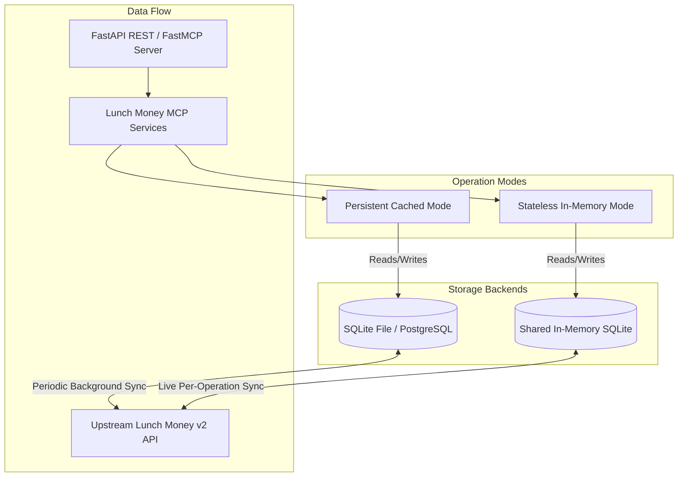

# 🚀 Lunch Money MCP — Master Roadmap & v2 API Coverage

## 📋 Executive Summary

This document serves as the master planning blueprint for **Lunch Money MCP**. It details:

1. Dual **Deployment Architectures** (Persistent Cached Mode vs. Stateless In-Memory Mode).
2. A **100% Granular Mapping** of all 39 endpoints across 10 domain areas in the [Lunch Money v2 OpenAPI Specification](https://alpha.lunchmoney.dev/v2/docs).
3. An 8-sprint implementation history through complete v2 API coverage, followed by a prioritized operational-product roadmap.

---

## 🏛️ Deployment & Persistence Architectures

### 1. Persistent Cached Mode (Default)

- **Database Engine**: Persistent SQLite file (`lunchmoney.db`) or PostgreSQL database (`postgresql+asyncpg://`).
- **Sync Strategy**: Background worker or explicit `/sync` calls fetch upstream updates and upsert changes into the database. Reads are served instantaneously from local disk/database cache.
- **Use Cases**: Local CLI usage, long-running MCP servers, home-server deployments (Docker Compose).

### 2. Stateless In-Memory Mode (`LUNCHMONEY_STATELESS=true`)

- **Database Engine**: Shared in-memory SQLite (`sqlite+aiosqlite:///file:memdb?mode=memory&cache=shared&uri=true`) configured with `StaticPool`.
- **Sync Strategy**: **100% refreshed from Lunch Money v2 API on demand**. For every request or operation:
    1. An in-memory SQLite database instance is initialized and schema tables are instantiated.
    2. Data is fetched live from the Lunch Money API and loaded into memory.
    3. The request/tool operation is executed against the fresh in-memory data graph.
- **Use Cases**: Ephemeral containers, serverless environments (AWS Lambda, Google Cloud Run, Vercel), security-restricted environments where storing financial data on disk is forbidden.

---

## 📊 Granular v2 API Endpoint Coverage Matrix (39 Endpoints)

### 1. User & Account Summary (`/me`, `/summary`)

| Upstream v2 Endpoint | Method | Local Route    | FastMCP Tool          | Service Function        | Status  |
| :------------------- | :----: | :------------- | :-------------------- | :---------------------- | :-----: |
| `/me`                | `GET`  | `GET /user`    | `get_user_info`       | `fetch_user_info`       | ✅ Done |
| `/summary`           | `GET`  | `GET /summary` | `get_account_summary` | `fetch_account_summary` | ✅ Done |

---

### 2. Categories Management (`/categories`)

| Upstream v2 Endpoint |  Method  | Local Route               | FastMCP Tool      | Service Function       | Status  |
| :------------------- | :------: | :------------------------ | :---------------- | :--------------------- | :-----: |
| `/categories`        |  `GET`   | `GET /categories`         | `list_categories` | `fetch_categories`     | ✅ Done |
| `/categories`        |  `POST`  | `POST /categories`        | `create_category` | `create_category`      | ✅ Done |
| `/categories/{id}`   |  `GET`   | `GET /categories/{id}`    | `get_category`    | `fetch_category_by_id` | ✅ Done |
| `/categories/{id}`   |  `PUT`   | `PUT /categories/{id}`    | `update_category` | `update_category`      | ✅ Done |
| `/categories/{id}`   | `DELETE` | `DELETE /categories/{id}` | `delete_category` | `delete_category`      | ✅ Done |

---

### 3. Manual Accounts (`/manual_accounts`)

| Upstream v2 Endpoint    |  Method  | Local Route                    | FastMCP Tool            | Service Function             | Status  |
| :---------------------- | :------: | :----------------------------- | :---------------------- | :--------------------------- | :-----: |
| `/manual_accounts`      |  `GET`   | `GET /accounts`                | `list_accounts`         | `fetch_accounts`             | ✅ Done |
| `/manual_accounts`      |  `POST`  | `POST /accounts/manual`        | `create_manual_account` | `create_manual_account`      | ✅ Done |
| `/manual_accounts/{id}` |  `GET`   | `GET /accounts/manual/{id}`    | `get_manual_account`    | `fetch_manual_account_by_id` | ✅ Done |
| `/manual_accounts/{id}` |  `PUT`   | `PUT /accounts/manual/{id}`    | `update_manual_account` | `update_manual_account`      | ✅ Done |
| `/manual_accounts/{id}` | `DELETE` | `DELETE /accounts/manual/{id}` | `delete_manual_account` | `delete_manual_account`      | ✅ Done |

---

### 4. Plaid Accounts (`/plaid_accounts`)

| Upstream v2 Endpoint    | Method | Local Route                 | FastMCP Tool          | Service Function            | Status  |
| :---------------------- | :----: | :-------------------------- | :-------------------- | :-------------------------- | :-----: |
| `/plaid_accounts`       | `GET`  | `GET /accounts`             | `list_accounts`       | `fetch_accounts`            | ✅ Done |
| `/plaid_accounts/{id}`  | `GET`  | `GET /accounts/plaid/{id}`  | `get_plaid_account`   | `fetch_plaid_account_by_id` | ✅ Done |
| `/plaid_accounts/fetch` | `POST` | `POST /accounts/plaid/sync` | `trigger_plaid_fetch` | `trigger_plaid_fetch`       | ✅ Done |

---

### 5. Transactions Management (`/transactions`)

| Upstream v2 Endpoint |  Method  | Local Route                 | FastMCP Tool               | Service Function            | Status  |
| :------------------- | :------: | :-------------------------- | :------------------------- | :-------------------------- | :-----: |
| `/transactions`      |  `GET`   | `GET /transactions`         | `get_recent_transactions`  | `fetch_recent_transactions` | ✅ Done |
| `/transactions`      |  `POST`  | `POST /transactions`        | `create_transactions`      | `create_transactions`       | ✅ Done |
| `/transactions`      |  `PUT`   | `PUT /transactions`         | `bulk_update_transactions` | `bulk_update_transactions`  | ✅ Done |
| `/transactions`      | `DELETE` | `DELETE /transactions`      | `bulk_delete_transactions` | `bulk_delete_transactions`  | ✅ Done |
| `/transactions/{id}` |  `GET`   | `GET /transactions/{id}`    | `get_transaction`          | `fetch_transaction_by_id`   | ✅ Done |
| `/transactions/{id}` |  `PUT`   | `PUT /transactions/{id}`    | `update_transaction`       | `update_transaction`        | ✅ Done |
| `/transactions/{id}` | `DELETE` | `DELETE /transactions/{id}` | `delete_transaction`       | `delete_transaction`        | ✅ Done |

---

### 6. Transaction Grouping & Splitting (`/transactions/group`, `/transactions/split`)

| Upstream v2 Endpoint       |  Method  | Local Route                       | FastMCP Tool           | Service Function       | Status  |
| :------------------------- | :------: | :-------------------------------- | :--------------------- | :--------------------- | :-----: |
| `/transactions/group`      |  `POST`  | `POST /transactions/group`        | `group_transactions`   | `group_transactions`   | ✅ Done |
| `/transactions/group/{id}` | `DELETE` | `DELETE /transactions/group/{id}` | `ungroup_transactions` | `ungroup_transactions` | ✅ Done |
| `/transactions/split/{id}` |  `POST`  | `POST /transactions/split/{id}`   | `split_transaction`    | `split_transaction`    | ✅ Done |
| `/transactions/split/{id}` | `DELETE` | `DELETE /transactions/split/{id}` | `unsplit_transaction`  | `unsplit_transaction`  | ✅ Done |

---

### 7. Transaction Attachments (`/transactions/attachments`)

| Upstream v2 Endpoint                  |  Method  | Local Route                                  | FastMCP Tool        | Service Function                | Status  |
| :------------------------------------ | :------: | :------------------------------------------- | :------------------ | :------------------------------ | :-----: |
| `/transactions/{id}/attachments`      |  `POST`  | `POST /transactions/{id}/attachments`        | `upload_attachment` | `upload_transaction_attachment` | ✅ Done |
| `/transactions/attachments/{file_id}` |  `GET`   | `GET /transactions/attachments/{file_id}`    | `get_attachment`    | `fetch_attachment_by_id`        | ✅ Done |
| `/transactions/attachments/{file_id}` | `DELETE` | `DELETE /transactions/attachments/{file_id}` | `delete_attachment` | `delete_attachment`             | ✅ Done |

---

### 8. Tags Management (`/tags`)

| Upstream v2 Endpoint |  Method  | Local Route         | FastMCP Tool | Service Function  | Status  |
| :------------------- | :------: | :------------------ | :----------- | :---------------- | :-----: |
| `/tags`              |  `GET`   | `GET /tags`         | `list_tags`  | `fetch_tags`      | ✅ Done |
| `/tags`              |  `POST`  | `POST /tags`        | `create_tag` | `create_tag`      | ✅ Done |
| `/tags/{id}`         |  `GET`   | `GET /tags/{id}`    | `get_tag`    | `fetch_tag_by_id` | ✅ Done |
| `/tags/{id}`         |  `PUT`   | `PUT /tags/{id}`    | `update_tag` | `update_tag`      | ✅ Done |
| `/tags/{id}`         | `DELETE` | `DELETE /tags/{id}` | `delete_tag` | `delete_tag`      | ✅ Done |

---

### 9. Recurring Items (`/recurring_items`)

| Upstream v2 Endpoint    | Method | Local Route                 | FastMCP Tool           | Service Function             | Status  |
| :---------------------- | :----: | :-------------------------- | :--------------------- | :--------------------------- | :-----: |
| `/recurring_items`      | `GET`  | `GET /recurring_items`      | `list_recurring_items` | `fetch_recurring_items`      | ✅ Done |
| `/recurring_items/{id}` | `GET`  | `GET /recurring_items/{id}` | `get_recurring_item`   | `fetch_recurring_item_by_id` | ✅ Done |

---

### 10. Budgets & Local Analytics (`/budgets`, `/spending`)

| Upstream v2 Endpoint / Local Feature |  Method  | Local Route              | FastMCP Tool            | Service Function          | Status  |
| :----------------------------------- | :------: | :----------------------- | :---------------------- | :------------------------ | :-----: |
| `/budgets/settings`                  |  `GET`   | `GET /budgets/settings`  | `get_budget_settings`   | `fetch_budget_settings`   | ✅ Done |
| `/budgets`                           |  `PUT`   | `PUT /budgets`           | `upsert_budget`         | `set_budget_value`        | ✅ Done |
| `/budgets`                           | `DELETE` | `DELETE /budgets`        | `clear_budget`          | `clear_budget_value`      | ✅ Done |
| Local Analytics (Category Rollup)    |  `GET`   | `GET /spending/category` | `get_category_spending` | `fetch_category_spending` | ✅ Done |
| Local Analytics (Time Series)        |  `GET`   | `GET /spending/trends`   | `get_spending_trends`   | `fetch_spending_trends`   | ✅ Done |

---

## 🎯 Implementation Sprint Plan

### Sprint 0: Incremental ETL Engine Architecture

- [x] Add `LUNCHMONEY_STATELESS=true` setting & `IN_MEMORY_DATABASE_URL` resolution in `config.py`.
- [x] Add `StaticPool` in-memory SQLite initialization in `LunchMoneyDatabase`.
- [x] Add `db.create_tables()` schema initialization helper.
- [x] Add `SyncMetadata` table and opt-in incremental sync timestamp filtering.

### Sprint 1: Read-Only Complete Coverage (Tags, Recurring, Summary, Single-ID Lookups)

- [x] Implement `GET /summary` (`get_account_summary`)
- [x] Implement `GET /tags` & `GET /tags/{id}`
- [x] Implement `GET /recurring_items` & `GET /recurring_items/{id}`
- [x] Implement Single-ID GET routes (`/categories/{id}`, `/accounts/manual/{id}`, `/accounts/plaid/{id}`, `/transactions/{id}`)

### Sprint 2: Category & Account Mutations (Write Operations)

- [x] Implement Category mutations (`POST`, `PUT`, `DELETE` `/categories`)
- [x] Implement Manual Account mutations (`POST`, `PUT`, `DELETE` `/manual_accounts`)
- [x] Implement Plaid sync trigger (`POST /plaid_accounts/fetch`)

### Sprint 3: Transaction Mutations & Advanced Operations

- [x] Implement Transaction CRUD (`POST`, `PUT`, `DELETE` `/transactions`)
- [x] Implement Bulk Transaction operations (`PUT`, `DELETE` `/transactions`)
- [x] Implement Transaction Grouping (`POST /transactions/group`, `DELETE /transactions/group/{id}`)
- [x] Implement Transaction Splitting (`POST /transactions/split/{id}`, `DELETE /transactions/split/{id}`)
- [x] Implement Transaction Attachments (`POST`, `GET`, `DELETE` `/transactions/attachments`)

### Sprint 4: Budgets, Analytics & Production Security

- [x] Implement Budget Values (`PUT /budgets`, `DELETE /budgets`)
- [x] Implement Spending Trends time-series analysis (`GET /spending/trends`)
- [x] API Key auth guard & GitHub Actions CI/CD workflows (`.github/workflows/ci.yaml`).

### Sprint 5: MCP Primitives, Transports & CI/CD

- [x] Add the executable entrypoint and mutually exclusive stdio, SSE, HTTP, and Streamable HTTP transports.
- [x] Register MCP resources and prompts.
- [x] Add GitHub Actions validation and document local and remote MCP deployment.

### Sprint 6: Remote MCP OAuth & Roadmap Reconciliation

- [x] Add optional OIDC OAuth protection for remote MCP HTTP transports.
- [x] Document OAuth configuration, the public callback URL, and the local unauthenticated default.
- [x] Reconcile all delivered operations with the coverage matrix.

### Sprint 7: Tag Mutations & API Coverage Completion

- [x] Implement upstream-first tag creation, update, and deletion through REST and MCP.
- [x] Reconcile cached transaction-tag links before deleting a tag.
- [x] Complete the documented 39-endpoint Lunch Money v2 API matrix.

---

## 🧭 Post-Coverage Roadmap

The v2 API matrix is complete, but the upstream API is an open alpha and the
server still needs operational and product work. The following sprints are
ordered by dependency and deployment value. They are plans, not delivered
features.

### Sprint 8: Production Runtime & Scheduled Sync

- [x] Replace the FastAPI development CLI in deployment assets with Gunicorn
      serving the ASGI application through the maintained `uvicorn-worker` worker
      package. Keep direct Uvicorn for local development.
- [x] Add a dedicated `lunchmoney-mcp schedule` process using APScheduler's
      async scheduler and an explicit cron expression/timezone configuration for
      scheduled sync. Scheduling remains opt-in; `uvx lunchmoney-mcp mcp` and
      `serve` without embedded scheduling never start background work.
- [x] Define the initial schedule policy as full metadata refresh plus
      incremental transaction refresh, using the persisted transaction watermark
      and safety margin. The first run without a watermark bootstraps the rolling
      transaction window before subsequent runs become incremental.
- [x] Keep schedulers out of Gunicorn web workers. Do **not** use Gunicorn
      `--preload` as scheduler coordination: it preloads the app before worker
      forks and cannot guarantee one scheduler or one execution.
- [x] Make the default deployment topology one scheduler process plus one or
      more stateless web workers. Serialize sync through the existing distributed
      migration/sync lock and expose last-run status.
- [x] Keep APScheduler 3.11 in the supported single dedicated scheduler topology.
      APScheduler 3 job stores cannot be shared, so HA/multi-scheduler operation
      is explicitly unsupported; SQLite and PostgreSQL both use one scheduler.
- [x] Add graceful startup/shutdown, missed-run coalescing, one-at-a-time sync
      execution, structured run results, and integration coverage for duplicate
      scheduler prevention.

### Sprint 9: Upstream API Compatibility & Coverage Audit

- [x] Pin and regularly regenerate the generated Lunch Money client from the
      current upstream OpenAPI specification; diff paths, operations, schemas, and
      enum values in CI.
- [x] Add a machine-readable endpoint coverage manifest and a test that fails
      when a supported upstream operation lacks its REST/MCP/service mapping.
- [x] Validate supported operations against Lunch Money's mock service or a
      disposable test budget, with synthetic fixtures retained for unit tests.
- [x] Establish an alpha-API compatibility policy: version pinning, release
      notes review, deprecation handling, and a documented response for a breaking
      upstream change.

### Sprint 10: Operational Hardening & Observability

- [x] Add health, readiness, and dependency checks that distinguish a live
      process from a database-ready and scheduler-ready service.
- [x] Add structured logs, request IDs, safe error responses, and metrics for
      HTTP/MCP requests, upstream failures/rate limits, sync duration, and cache
      freshness. Export Prometheus-compatible metrics at `/metrics`; protect it by
      network policy or authentication. Never emit tokens or financial payloads in
      logs or metrics.
- [x] Set explicit trusted-proxy, allowed-host, CORS, request-size, timeout,
      concurrency, and rate-limit policies, all secure by default.
- [x] Document TLS termination, secret rotation, database backup/restore,
      retention, least-privilege deployment, and an incident/runbook checklist.
- [x] Add dependency/security scanning, container hardening, and production
      smoke tests to CI/CD.

### Sprint 11: Server-Rendered Financial Dashboard

- [x] Add a small, authenticated HTML dashboard served by FastAPI, using
      server-rendered templates and semantic HTML/CSS—no separate JavaScript
      application or client-side financial-data store. Scope the first release to
      one authenticated user and one Lunch Money account.
- [x] Start with dashboard cards for cache freshness, account summary,
      category spending, budget status, recent transactions, and the last scheduled
      sync outcome.
- [x] Reuse existing services and schemas; dashboard routes remain thin
      delegators and do not introduce duplicate analytics logic.
- [x] Ensure accessible keyboard navigation, responsive layouts, CSRF-safe
      forms for any future mutations, and integration tests for authorization and
      rendered empty/error states.
- [x] Establish Tabler as the locally served dashboard UI foundation, with a
      custom financial visual system layered over server-rendered templates.

### Sprint 12: CLI, Packaging & Operator Experience

- [x] Replace the single-purpose argument parser with discoverable subcommands:
      `mcp`, `serve`, `schedule`, `sync`, `doctor`, and `version`.
- [x] Keep MCP transport flags mutually exclusive under `mcp`; make the stdio
      default explicit in generated help and shell-completion documentation.
- [x] Provide config precedence and validation (`CLI > environment > .env >
defaults`), redacted `doctor` diagnostics, meaningful exit codes, and no
      secret values in output.
- [x] Publish Docker Compose as the first-class deployment path, with
      API-only, MCP-only, combined, and dedicated-scheduler examples; add
      release/versioning and upgrade documentation.
